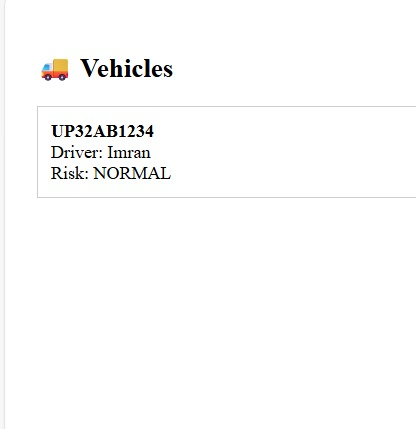
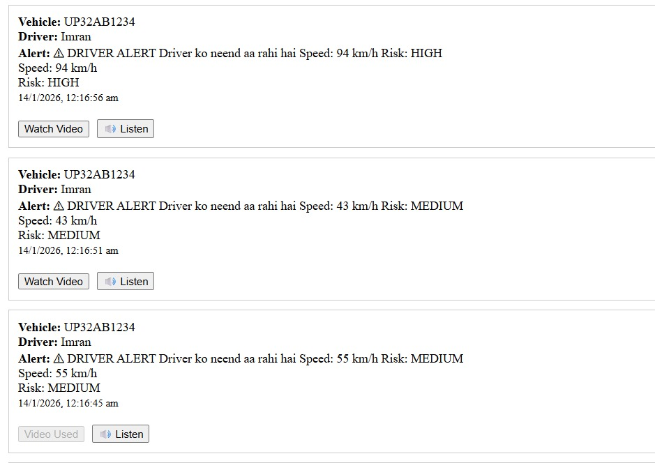
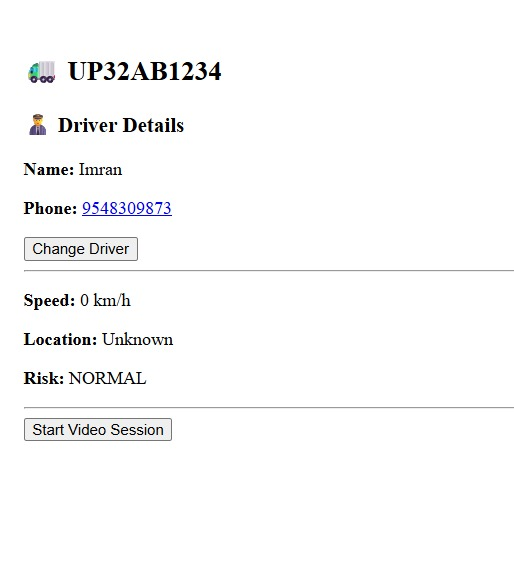
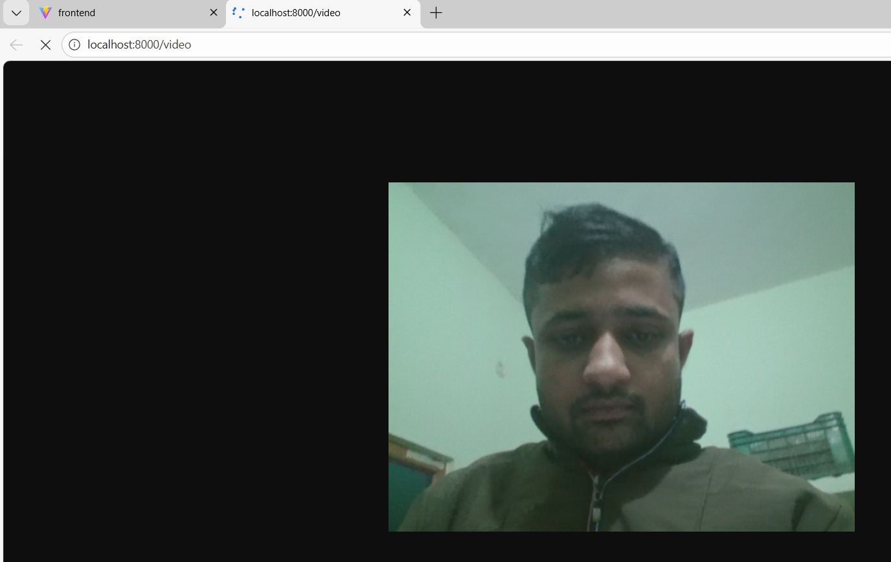

# 🚛 DriveSafe AI 

### Real-Time Driver Monitoring & Alert System

DriveSafe AI is a real-world inspired system designed to improve road safety by monitoring driver behavior in real time and alerting vehicle owners when risky situations occur (drowsiness, overspeeding, abnormal activity).

This project simulates how modern fleet-monitoring and driver-safety solutions are built in production environments.

---

## 🎯 Problem Statement

Long-distance drivers often face fatigue, distraction, and sleep deprivation, which are major causes of road accidents.  
Fleet owners usually have **no real-time visibility** into:

- Whether a driver is alert or drowsy
- What the driver is doing inside the cabin
- When to intervene before an accident happens

DriveSafe AI addresses this gap.

---

## 💡 Solution Overview

DriveSafe AI provides:

- **Real-time driver eye monitoring**
- **Instant alerts to the vehicle owner**
- **Live video access during risky situations**
- **Vehicle-wise monitoring dashboard**
- **Alert history with detailed context**

The system is designed keeping **real-world constraints** in mind:
- Limited internet
- Low-cost hardware
- Non-technical drivers
- Owner-centric control

---

## 🧠 Key Features

### 🚨 Driver Drowsiness Detection
- Eye-blink based detection using computer vision
- Detects prolonged eye closure indicating fatigue

### 📹 On-Demand Live Video
- Owner can view live cabin video
- Session-limited to prevent misuse
- Separate logic for:
  - Manual owner checks
  - Alert-triggered access

### 🧾 Alert History
- All alerts stored with:
  - Vehicle number
  - Driver details
  - Alert reason (sleep, risk, speed)
  - Timestamp
- One-click access to live video from alerts

### 🚛 Multi-Vehicle Support
- Owner dashboard supports multiple vehicles
- Easy driver reassignment per vehicle
- Clear vehicle identification

---

## 🏗️ System Architecture

Driver Camera (Phone / Camera)                                                                                
↓                                                                                                             
Python (Computer Vision + Detection)                                                                          
↓                                                                                                             
Node.js / Express (API Layer)                                                                                 
↓                                                                                                    
MongoDB (Alerts & Vehicle Data)                                                                        
↓                                                                                              
React Dashboard (Owner View)                                                                           

---

## 🧪 Tech Stack

### Frontend
- React (Vite)
- REST API integration
- Real-time UI updates

### Backend
- Node.js
- Express.js
- MongoDB (Atlas – Free Tier)

### Computer Vision
- Python
- OpenCV
- MediaPipe (Face & Eye landmarks)

---

## ⚠️ Engineering Challenges Faced

This project intentionally documents **real challenges** faced during development:

- Camera resource conflicts on Windows
- Limitations of laptop webcams for live streaming
- OS-level constraints in real-time video processing
- Session-based access control design

These challenges helped in understanding **production-level system limitations**, not just happy-path coding.

---

## 📌 Why This Project Matters

- Solves a **real transportation safety problem**
- Mimics **fleet management systems**
- Focuses on **practical engineering trade-offs**
- Demonstrates backend + frontend + CV integration

---

## 🚀 Future Improvements

- Dedicated Android driver app for GPS & speed
- Edge device support (Raspberry Pi / Jetson)
- Improved low-light detection
- Cloud video relay (WebRTC)
- AI-based risk scoring

---

## 👨‍💻 Developer Notes

This project was built with a **learning + real-world mindset**, focusing on:
- System thinking
- Debugging real constraints
- Designing owner-centric workflows

---

## 📷 Screenshots

### -- Owner Dashboard

### -- Alert History

### -- Vehicle Detail Page

### -- Live Video Session UI

---

## 📬 Contact

If you'd like to discuss system design, improvements, or real-world deployment scenarios, feel free to connect.

